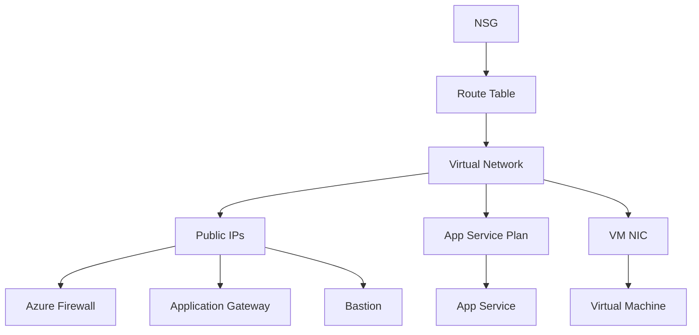

# Architecture Details

## Network Topology

The Azure End-to-End Networking Lab implements a multi-tier architecture with defense-in-depth security:

### Traffic Flow

```
┌─────────────────────────────────────────────────────────────────┐
│                          Internet                                │
└──────────────────────────────┬──────────────────────────────────┘
                               │
                               ↓
┌─────────────────────────────────────────────────────────────────┐
│                    Azure Front Door (Global)                     │
│  • Global load balancing & failover                             │
│  • DDoS protection                                               │
│  • SSL/TLS offloading                                           │
│  • WAF (Web Application Firewall)                               │
└──────────────────────────────┬──────────────────────────────────┘
                               │
                               ↓
┌─────────────────────────────────────────────────────────────────┐
│              Application Gateway (Regional)                      │
│  • Layer 7 load balancing                                       │
│  • URL-based routing                                            │
│  • SSL termination                                              │
│  • WAF capabilities                                             │
└──────────────────────────────┬──────────────────────────────────┘
                               │
                   ┌───────────┴───────────┐
                   │                       │
                   ↓                       ↓
        ┌──────────────────┐    ┌─────────────────┐
        │   App Service    │    │  Virtual Machine │
        │  (VNet Integrated)│    │   (Ubuntu 22.04)│
        └──────────────────┘    └─────────────────┘
                   │                       │
                   └───────────┬───────────┘
                               ↓
                    ┌────────────────────┐
                    │  Azure Firewall    │
                    │  • Network filter  │
                    │  • Threat intel    │
                    │  • DNAT/SNAT      │
                    └────────────────────┘
```

## Virtual Network Design

### Address Space: 10.0.0.0/16

| Subnet | CIDR | Purpose | Resources |
|--------|------|---------|-----------|
| **AppGatewaySubnet** | 10.0.1.0/24 | Application Gateway | App Gateway (requires dedicated subnet) |
| **AzureFirewallSubnet** | 10.0.2.0/24 | Azure Firewall | Firewall (must be named exactly this) |
| **VMSubnet** | 10.0.3.0/24 | Virtual Machines | Ubuntu VM |
| **AppServiceSubnet** | 10.0.4.0/24 | App Service Integration | Delegated to Microsoft.Web/serverFarms |
| **AzureBastionSubnet** | 10.0.5.0/24 | Bastion Service | Bastion Host (must be named exactly this) |

### Subnet Routing

- **VMSubnet**: Routes traffic through Azure Firewall (User-Defined Route)
- **AppServiceSubnet**: VNet integration for private connectivity
- **AzureFirewallSubnet**: No routing required (default gateway)
- **AppGatewaySubnet**: Direct internet access for inbound traffic

## Security Architecture

### Defense-in-Depth Layers

1. **Layer 1: Azure Front Door**
   - Global threat intelligence
   - DDoS protection (included)
   - Rate limiting
   - Geo-filtering capabilities

2. **Layer 2: Application Gateway WAF**
   - OWASP Top 10 protection
   - SQL injection prevention
   - XSS (Cross-Site Scripting) blocking
   - Custom WAF rules

3. **Layer 3: Azure Firewall**
   - Application rules (FQDN filtering)
   - Network rules (IP/Port filtering)
   - Threat intelligence feed
   - IDPS (Intrusion Detection & Prevention)

4. **Layer 4: Network Security Groups (NSGs)**
   - Subnet-level filtering
   - Stateful firewall rules
   - Service tags for Azure services

5. **Layer 5: Azure Bastion**
   - No public IP exposure for VMs
   - Browser-based SSH/RDP
   - Just-in-time access ready

## Resource Dependencies

### Deployment Order



## High Availability Considerations

### Application Gateway
- Deploys 2 instances by default
- Auto-scales based on traffic
- Zone-redundant (if supported in region)

### Azure Firewall
- Deploys across availability zones (where available)
- 99.95% SLA with zones
- Active-Active configuration possible

### App Service
- Built-in redundancy in service plan
- Auto-healing capabilities
- Deployment slots for zero-downtime updates

### Front Door
- Global anycast network
- Automatic failover between backends
- 99.99% SLA

## Monitoring & Diagnostics

### Log Analytics Integration

The deployment includes a Log Analytics workspace for:

- **Azure Firewall Logs**
  - Application rules
  - Network rules
  - DNS proxy logs
  
- **Application Gateway Logs**
  - Access logs
  - Performance logs
  - Firewall logs (WAF)

- **NSG Flow Logs** (Optional)
  - Traffic analysis
  - Security audit

### Recommended Queries

**Firewall blocked traffic:**
```kql
AzureDiagnostics
| where Category == "AzureFirewallApplicationRule" or Category == "AzureFirewallNetworkRule"
| where msg_s contains "Deny"
| project TimeGenerated, msg_s
```

**Application Gateway backend health:**
```kql
AzureDiagnostics
| where ResourceType == "APPLICATIONGATEWAYS"
| where Category == "ApplicationGatewayAccessLog"
| summarize count() by backendPoolName_s, bin(TimeGenerated, 5m)
```

## Network Flow Examples

### Inbound Web Traffic (Public Internet → App Service)

```
User → Front Door → Application Gateway → App Service
     [Global]      [Regional WAF]         [VNet Integrated]
```

### Outbound Traffic from VM

```
VM → Azure Firewall → Internet
    [Forced Tunneling]  [Filtered]
```

### Cross-Subnet Communication

```
App Service → Azure Firewall → VM
[VNet Route]  [Network Rules]   [Private IP]
```

## Customization Options

### Scale Up Options

1. **Application Gateway**: Upgrade to WAF_v2 for enhanced protection
2. **Azure Firewall**: Change to Premium tier for TLS inspection
3. **App Service**: Scale to Premium (Pv2/Pv3) for more capacity
4. **VM**: Increase size for compute-intensive workloads

### Additional Features to Consider

- **Azure Bastion Standard**: Enable tunneling, IP-based connections
- **Private Endpoints**: For storage accounts, Key Vault integration
- **Azure DDoS Protection Standard**: Enhanced DDoS mitigation
- **Azure Policy**: Enforce compliance and governance
- **Azure Monitor**: Advanced application insights
- **Traffic Manager**: Multi-region failover

## Security Best Practices

✅ **Implemented in this lab:**
- Private networking with VNet integration
- WAF protection at multiple layers
- Centralized firewall for egress traffic
- Secure VM access via Bastion
- NSG rules for subnet isolation

⚠️ **Additional recommendations for production:**
- Enable Azure DDoS Protection Standard
- Implement Azure Policy for compliance
- Configure diagnostic settings for all resources
- Set up alerts for security events
- Use managed identities instead of passwords
- Enable Azure Security Center recommendations
- Implement backup and disaster recovery
- Use Azure Key Vault for secrets management
- Enable encryption at rest and in transit
- Implement network segmentation with micro-segmentation

## Troubleshooting

### Common Issues

**Issue: Application Gateway health probe failing**
- Verify App Service is running
- Check backend pool configuration
- Verify health probe settings match app endpoint

**Issue: Cannot connect to VM**
- Ensure Bastion deployment completed
- Check NSG rules on VMSubnet
- Verify VM is running

**Issue: Firewall blocking legitimate traffic**
- Review firewall logs in Log Analytics
- Add application or network rule as needed
- Check rule priority and order

**Issue: Front Door not routing traffic**
- Verify origin group health status
- Check Application Gateway public IP is accessible
- Review Front Door routing rules

## Performance Optimization

### Application Gateway
- Enable HTTP/2 for better performance
- Configure connection draining
- Optimize backend pool health probes
- Use cookie-based affinity if needed

### Azure Firewall
- Use FQDN tags instead of wildcards
- Consolidate rules to reduce processing
- Enable DNS proxy for better visibility
- Use threat intelligence mode "Alert and Deny"

### App Service
- Enable Always On for warm startup
- Configure auto-scale rules
- Use deployment slots for testing
- Enable Application Insights

## Cost Optimization Tips

1. **Stop resources when not in use:**
   ```bash
   # Stop VM
   az vm deallocate --resource-group rg-netlab --name netlab-vm
   
   # Stop App Service
   az webapp stop --resource-group rg-netlab --name netlab-app-xyz
   ```

2. **Use lower SKUs for testing:**
   - App Gateway: Standard_v2 (1 instance)
   - App Service: B1 or S1
   - VM: B1s or B2s
   - Firewall: Consider Firewall Basic (preview)

3. **Set auto-shutdown for VM:**
   - Configure in Azure Portal under VM → Operations → Auto-shutdown

4. **Review Azure Advisor recommendations:**
   - Navigate to Azure Advisor in Portal
   - Check cost optimization suggestions
